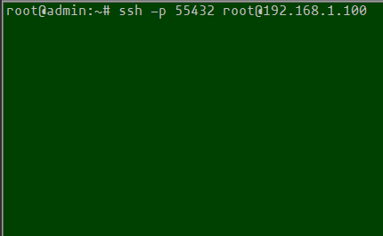
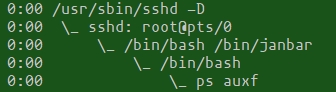
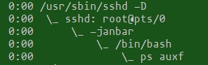
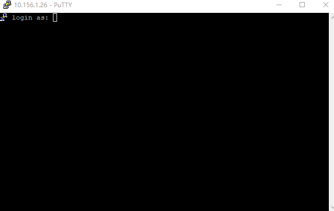

# sshdTwoVerification

#### 介绍
ssh登录二次验证  
问题：现在很多人的Linux服务器可能会被攻击，只校验一次后台用户名密码登录变得不再保险。  
  当然大家首先要做的是修改ssh服务端口，不要用默认22，这样会增加攻击难度，但还是不保险。  

方案1：使用ssh密钥文件登录，好处就是拿不到密钥文件休想登录成功，而且还能对密钥文件再次添加密码，  
  这样的方案确实比较保险。但也有弊端，就是需要将密钥文件存到网盘或别的地方，不然找不到密钥文件就GG了。  

方案2：隆重推出本项目的方案，替换登录时使用的bash，让替换后的程序再次以自定义的方案验证一次，  
  这样就做到了登录的二次验证，无疑增加了安全性。注意此时服务器已经不能使用scp等一些工具，安全性极大的提高。  

最近看到网上有【[解密Secucrt密码的教程](http://www.361way.com/securecrt-password-ini/6345.html)】，简直恐怖，我把脚本放到项目了【[SecucrtPassword.py](SecucrtPassword.py)】  
只需要把【C:\Users\XXX\AppData\Roaming\VanDyke\Config\Sessions】相关ini文件里面明文加密字符串拿来解密就行了。不过即使使用密钥文件，也会存在别人偷偷用你电脑用你的各种工具来进入服务器后台，因此ssh二次校验很有必要。  
```
# pip install PyCryptodome
python SecucrtPassword.py enc -v2 admin
python SecucrtPassword.py dec -v2 4b3e1481ecaef028e71b783fd5a01009548c85f0766f0160e1986182d68341755a41318557fa24a41ddf04fae14dfd12
```

#### 安装教程,janbar.sh

1.  echo '/bin/janbar' >> /etc/shells ,确保/etc/shells里面有一行/bin/janbar即可  
2.  cp janbar.sh /bin/janbar && chmod 777 /bin/janbar  
3.  echo 'admin:passwd' > /etc/janbar  
4.  vim /etc/passwd , 将[root:x:0:0:root:/root:**/bin/bash**]改为[root:x:0:0:root:/root:**/bin/janbar**]  
5.  重新登录后台，需要输入/etc/janbar这个文件中的用户名和密码  
  
6.  执行ps auxf，可以看到成功进入后台相关进程树  
  

#### 安装教程,janbar.c

1.  echo '/bin/janbar' >> /etc/shells ,确保/etc/shells里面有一行/bin/janbar即可  
2.  gcc -s janbar.c -o /bin/janbar  
3.  echo 'admin:passwd' > /etc/janbar  
4.  vim /etc/passwd , 将[root:x:0:0:root:/root:**/bin/bash**]改为[root:x:0:0:root:/root:**/bin/janbar**]  
5.  重新登录后台，需要输入/etc/janbar这个文件中的用户名和密码，登录图片和janbar.sh的类似。  
6.  执行ps auxf，可以看到成功进入后台相关进程树  
  

#### 安装教程,janbar.qrencode.sh
1.  使用[二维码库](https://fukuchi.org/works/qrencode/)，编译后取出本项目qrencode目录那几个文件即可。  
2.  cp janbar.qrencode.sh /bin/janbar && chmod 777 /bin/janbar  
3.  echo 'admin' > /etc/janbar  
4.  vim /etc/passwd , 将[root:x:0:0:root:/root:**/bin/bash**]改为[root:x:0:0:root:/root:**/bin/janbar**]  
5.  重新登录后台，此时出现一张二维码，用微信扫描一下二维码并计算出结果，例如结果为15，则要输入admin15。  
  

#### 安装教程,janbar.qrencode.c
1.  使用【[二维码库](https://fukuchi.org/works/qrencode/)】，编译后取出本项目qrencode目录那几个文件即可。  
2.  gcc -s -o /bin/janbar janbar.qrencode.c ./qrencode/libqrencode.so.4  
3.  echo 'admin' > /etc/janbar  
4.  vim /etc/passwd , 将[root:x:0:0:root:/root:**/bin/bash**]改为[root:x:0:0:root:/root:**/bin/janbar**]  
5.  重新登录后台，此时出现一张二维码，用微信扫描一下二维码并计算出结果，例如结果为15，则要输入admin15。  
6.  qrencode\qrencode是Linux下可执行程序,qrencode\libqrencode.so.4是编译好的库

#### 结语
1.  我的两种方案都有对输入做超时检测，如果超过时间没有输入后台也会自动退出，同样输入错误3次也会自动退出。  
2.  有些小伙伴后台不是root登录，可以找/etc/passwd里面对应用户名那行做同样的修改即可。  
3.  之所以我要做2中方案，是因为janbar.sh方便修改，而janbar.c逼格满满。  
4.  并且已经加入控制台显示一张二维码，带有简单的加和乘计算，输入二次验证时需要计算，逼格和安全全满。  
5.  需要注意的一点，这样的后台是无法使用scp、sftp等直接连接，除非这些工具也能完成二次验证，但sz和rz不影响。  
6.  对于某些安全性高的服务器，不能信任ssh工具，因为这些工具保存的密码可能被解密，如果有必要甚至可以每隔一段时间踢掉所有ssh登录的用户，用这个命令即可（pkill -kill -t pts/0）
